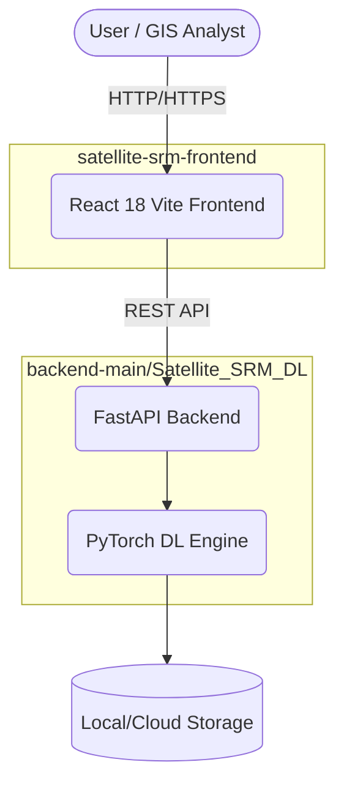

# 🏗️ System Architecture

## Overview
**Satellite-SRM (SRM-X)** is a distributed system comprising a deep-learning processing backend and an interactive web frontend, designed to reconstruct sub-4m spatial resolution geospatial products from 10m Sentinel-2 multispectral imagery.

## High-Level Topology

## Components

### 1. Frontend (Mission Control)
- **Framework**: React 18 with Vite
- **Styling**: Tailwind CSS
- **State**: Zustand (reactive job telemetry)
- **Maps/GIS**: Leaflet, Recharts

### 2. Backend (Deep Learning Engine)
- **Framework**: FastAPI (async REST endpoints)
- **ML Framework**: PyTorch (SwinIR / Diffusion models)
- **GIS Processing**: GDAL, Rasterio, GeoPandas

## Pipeline Workflow
1. User uploads Sentinel-2 L2A data.
2. Backend validates data and generates patches.
3. PyTorch engine performs multi-band super resolution inference.
4. Output patches are blended back together seamlessly.
5. GeoTIFFs (with updated EPSG) and uncertainty maps are generated.
6. Frontend polls for results and displays them on interactive dual-view sliders.
